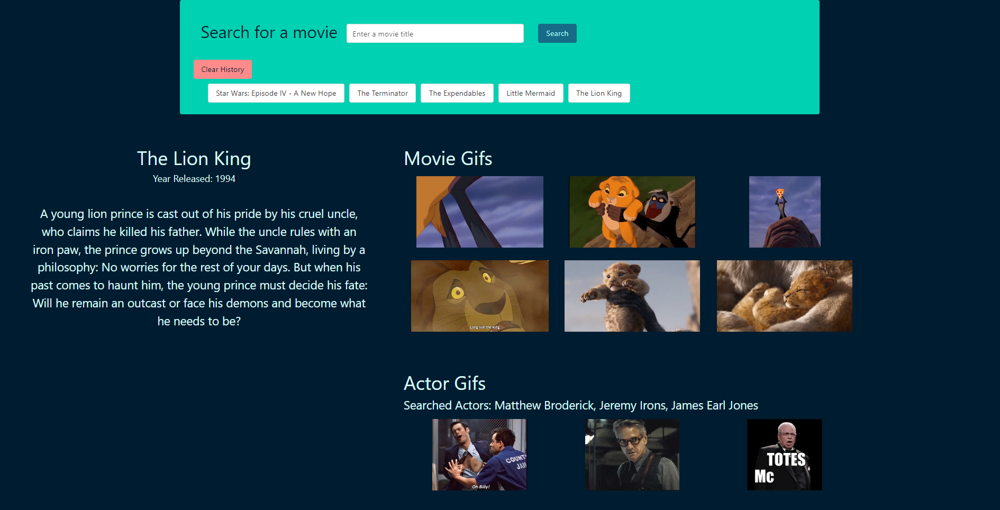

# Movie-Giphy

 Looks like this 

## Purpose 

Movie-Giphy is a web application that takes in a movie name as the user input and displays the movie's summary and related gifs. The gifs are categorized by movie name related gifs, and actors names related gifs. The user is initially prompted to enter a valid movie; the application will then use that movie's name to request and fetch information from two diffferent APIs (Open Movie Database, Giphy). The summary is retreived from the OMD and both gifs categories are retreived from Gify 

### Installation 

Please launch the web application on your default browser

#### Built with 

* HTML
* CSS
* JS
* jQuery
* Bulma
* APIs:
       ~ Open Movie Database
       ~ Gify 
#####  Deployment 

https://uwlryoung.github.io/movie-giphy/

######   Contribution

Made by:     * Edward Chang
             * Youssef Karoui
             * Lucas Young
             * Corey Obiri

